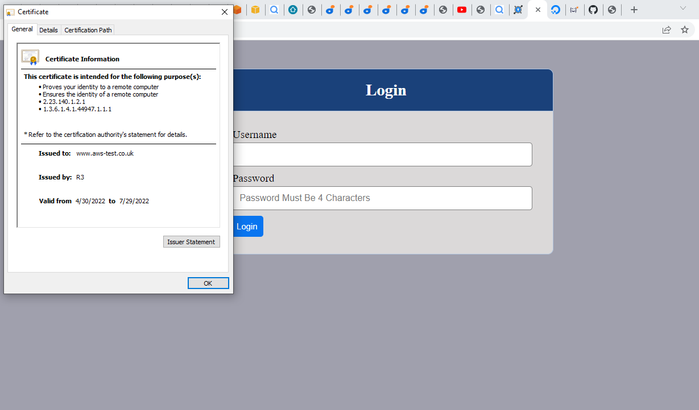
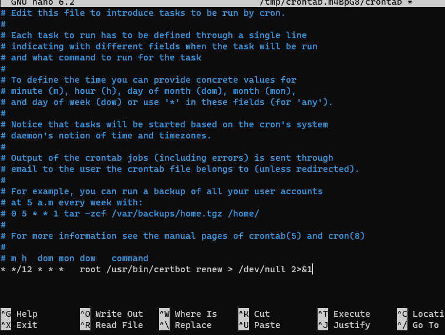

# Documentation of project10
## Step1
1. I created an EC2 VM based on ubuntu and named it 'nginx-lb'
    
    

2. I updated ubuntu
   
   `sudo apt update`
   

3. I installed nginx

    `sudo apt install nginx`

    

4.  I updated '/etc/hosts' file with web servers name

    

5. I updated the configuration file too
    
    

6. I restarted Nginx and ensured it was up and running

## Step2
1. I registered a new domain name and hosted it

    

2. I linked it to an elastic ip that I just created
      
      

3.  I confirmed that my webserver can connect on my browser using the domain name
     
     

4.  I ensured snapd service was up and running
   
   

5.  I installed certbot

   

6.  I requested for my certificate

    

7.  I accessed my website on the browser and clicked on the padlock pictogram on my browser's search string
    

8.  I tested the renewal command in dry mode

     `sudo certbot renew --dry-run`
  
    
9.  I configured a 'crownjob' to run renew command periodically
    `crontab -e`
    
    

